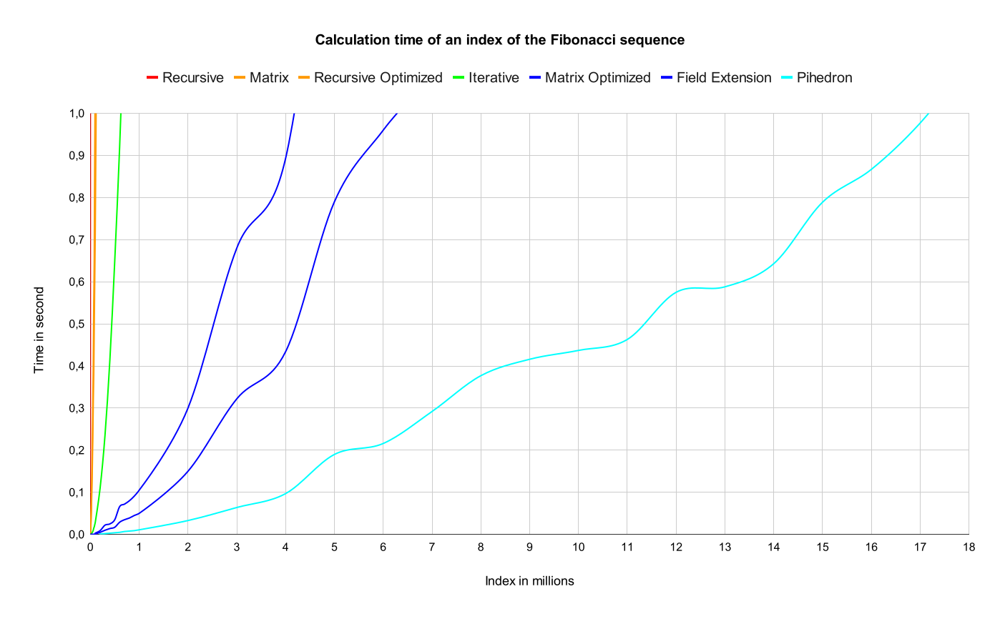

# 🔢 Figonacci


Figonacci is a tool and package wich calculates the largest Fibonacci number that can be calculated in less than a second (can be changed) using different algorithms. It also includes functionality to measure the calculation time of a specific Fibonacci number.

## 📋 Summary

### 1. [Features](#1---features)

### 2. [Installation](#2---installation)

- #### 2.1 [Executable](#executable)
- #### 2.2 [Package](#package)

### 3. [How to use](#3---how-to-use)

- #### 3.1 [Executable](#with-the-binary-file)
- #### 3.2 [Package](#with-the-package)

### 4. [Algorithms](#4---algorithms)

### 5. [Benchmark](#5---benchmark)

### 6. [Improve the project](#6---improve-the-project)

### 7. [Credits](#7---credits)

## 1 - Features

- Find the largest Fibonacci number that can be calculated in less than a second (limit can be changed)
- Calculate the time it takes to calculate a specific Fibonacci number
- Use different algorithms to calculate the Fibonacci number among [6 of them](#4---algorithms)
- Use the package in your own project

## 2 - Installation

To begin, two options are available to you:

- ### Executable

  If you want to use the tool directly, you can download the latest release from the [releases page]()

- ### Package

  If you want to use the package in your own project, you can install it with the following command in your current project:

  ```go
  go get github.com/Pietot/Figonacci
  ```

## 3 - How to use

- ### With the binary file

  If you've downloaded a binary, just open a CLI and write:

  ```bash
  cd {path to the .exe}
  figonacci.exe
  ```

  Then it will print you how to use the tool correctly but I will explain it here further:

  - #### Timer

    Use the following commande if you want to find the largest Fibonacci number that can be calculated in less than a specific time:

    ```bash
    figonacci.exe timer --algorithm [--limit]
    ```

    - **algorithm**: Where you specify the algorithm you want to use, you can see them [here](#4---algorithms)
    - **limit** This flag is optional, if not provided, it will be set to 1 second by default. You can put 0.1 for 100ms or 120 for 2 minutes

    For example:

    ```bash
    figonacci.exe timer --ro --0.25
    ```

  - #### Compute

    Use the following commande if you want to compute the time it takes to calculate a specific Fibonacci number:

    ```bash
    figonacci.exe compute --algorithm --number
    ```

    - **algorithm**: Where you specify the algorithm you want to use, you can see them [here](#4---algorithms)
    - **number** The Fibonacci index you want to calculate, it must be a positive integer

    For example:

    ```bash
    figonacci.exe compute --i --75648
    ```

  After that, the tool will print you the results.

  For more flexibility, put the path to the exe file in your PATH environment so you can use it from anywhere just by typing `fibonacci.exe`.

- ### With the package

  After installing the package, you can use it in your own project depending on your needs.

  - #### algorithms package

    This package contains all the algorithms used to calculate the Fibonacci number.

    ```go
    package main

    import (
      "context"
      "fmt"

      "github.com/Pietot/Figonacci/algorithms"
    )

    func main() {
      // Calculate F(16 180) with the matrix algorithm.
      // context.Background() is used to set no limit to the calculation time.
      // You can set a limit with context.WithTimeout(context.Background(), time.Second)
      result := algorithms.Matrix(16180, context.Background())
      fmt.Println(result)
    }
    ```

  - #### timer package

    Use this package if you want to find the largest Fibonacci number that can be calculated in less than a specific time or calculate the time it takes to calculate a specific Fibonacci number.

    - #### Find the largest Fibonacci number that can be calculated in less than a specific time

      ```go
      package main

      import (
        "fmt"

        "github.com/Pietot/Figonacci/algorithms"
        "github.com/Pietot/Figonacci/timer"
      )

      func main() {
        // Find the largest Fibonacci number that can be calculated in less than 0.5s.
        // You can replace sentence with "_" if you don't want to use it (most likely).
        sentence, results := timer.Timer(algorithms.Iterative, 0.5)
        fmt.Println(sentence, results)
      }
      ```

      > **Note**: The runtime will surely be longer than the limit set because of the time it takes to search for the largest Fibonacci number.

    - #### Calculate the time it takes to calculate a specific Fibonacci number

      ```go
      package main

      import (
        "fmt"

        "github.com/Pietot/Figonacci/algorithms"
        "github.com/Pietot/Figonacci/timer"
      )

      func main() {
        // Compute F(314 159) with the field extension algorithm.
        // You can replace sentence with "_" if you don't want to use it (most likely).
        sentence, results := timer.Compute(algorithms.FieldExtension, 314159)
        fmt.Println(sentence, results)
      }
      ```

You can see all the algorithms available in the package [here](#4---algorithms).

## 4 - Algorithms

All the algorithms are implemented in the package and can be used in the tool. They are explained from the easiest to the hardest to understand.

- ### Iterative

  We start with the two first numbers of the sequence which are 0 and 1 and we calculate the next one by adding the two previous numbers. We repeat this operation until we reach the desired index.

  - Flag: `--iterative` or `--i`
  - algorithm name: `algorithms.Iterative`

- ### Recursive

  We calculate the Fibonacci number of the index by calling the function recursively with the two previous numbers. We stop when we reach the base case which is the two first numbers of the sequence.

  - Flag: `--recursive` or `--r`
  - algorithm name: `algorithms.Recursive`

- ### Recursive with memoisation

  Same as the recursive algorithm but we store the result of each index in a map to avoid recalculating the same index multiple times. If the index is already calculated, we return the result from the map, otherwise we calculate it and store it in the map.

  - Flag: `--recursive_optimized` or `--ro`
  - algorithm name: `algorithms.RecursiveOptimized`

- ### Matrix

  We use a matrix to calculate the Fibonacci number of the index. We use the following formula:

  #### F(n) = [[1, 1], [1, 0]] ^ (n-1) * [1, 0]

  - Flag: `--matrix` or `--m`
  - algorithm name: `algorithms.Matrix`

- ### Matrix with fast exponentiation

  Same as the matrix algorithm but we use fast exponentiation to calculate the power of the matrix.
  Fast exponentiation is a method to calculate the power of a number in logarithmic time.
  It works by dividing the power by 2 and calculating the square of the number until the power is 0.

  - Flag: `--matrix_optimized` or `--mo`
  - algorithm name: `algorithms.MatrixOptimized`

- ### Field Extension

  I'm gonna be honest, I didn't understang a single step of this algorithm but it works and it's the fastest one.

  If you want the explanation of this method, you can watch the video I looked [here](https://youtu.be/KzT9I1d-LlQ?t=1177).

  - Flag: `--field_extension` or `--fe`
  - algorithm name: `algorithms.FieldExtension`

## 5 - Benchmark

Here are the algorithms ranked from the fastest to the slowest over a second:

| Rank |              Algorithm              | Index | Search time | Max memory used | Implementation |
| :--: | :---------------------------------: | :---: | :---------: | :-------------: | :------------: |
|  1   |         **Field Extension**         | ~6.5M |    ~24s     |      ~27Mo      |       💀       |
|  2   | **Matrix with fast exponentiation** | ~4.2M |   ~24.5s    |      ~60Mo      |    Average     |
|  3   |            **Iterative**            | ~630K |    ~21s     |      ~7Mo       |      Free      |
|  4   |   **Recursive with memoisation**    | ~192K |    18.5s    |      ~7Go       |     Tricky     |
|  5   |             **Matrix**              | 81918 |    ~14s     |      ~75Mo      |    Average     |
|  6   |            **Recursive**            |  33   |    ~6.5s    |      ~8Mo       |      Easy      |

<br>



<p align="center">
  <a href="assets/csv/figonnacci.csv">Download csv here</a>
</p>

> **Note**: Tests have been made on a 64-bit Windows 10 computer with a Ryzen 5 3600 and 16GB of RAM clocked at 3600MHz in go1.22.5 windows/amd64.

Then, we can put the graph to a logarithmic scale to evaluate the complexity of each algorithm:


|              Algorithm              | Time Complexity |
| :---------------------------------: | :-------------: |
|         **Field Extension**         |   ~ O(n^1.58)   |
| **Matrix with fast exponentiation** |   ~ O(n^1.54)   |
|            **Iterative**            |   ~ O(n^1.67)   |
|   **Recursive with memoisation**    |   ~ O(n^1.62)   |
|             **Matrix**              |   ~ O(n^1.8)    |
|            **Recursive**            |     O(2^n)      |

> **Note**: Except for the recursive algorithm, all the others time complexities are approximations and not the real ones.

## 6 - Improve the project

If you like this project and/or want to help or improve it, you can:

- Create an issue if you find a bug or want to suggest a feature or any improvement (no matter how small it is).

- Create a pull request if you want to add a feature, fix a bug or improve the code.

- Contact me if you want to talk about the project or anything else (Discord: pietot).

> **Note**: If you want to be guided/helped, you already have a file named <a href="improvements.txt">improvements.txt</a> in the project directory, where you can see all the improvements that can be made.

# 7 - Credits

- **[Original video](https://www.youtube.com/watch?v=KzT9I1d-LlQ)**: The video that inspired me to create this project.
- **[Original source code](https://github.com/SheafificationOfG/Fibsonicci)**: The source code of the video.
